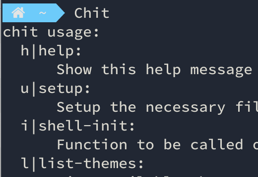
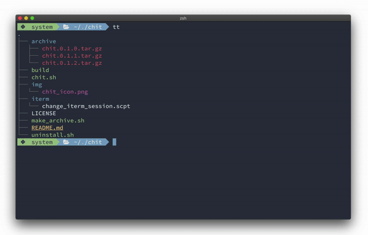

<p align="center">
  <br>
  <b>chit</b>: For <b>ch</b>anging <b>t</b>hemes.
</p>

<p align="center">
  <br>
</p>

<p align="center">
  <a href="#introduction">Introduction</a> •
  <a href="#how-to-use">How To Use</a> •
  <a href="#how-it-works">How it Works</a><br>
  <a href="#installation">Installation</a> •
  <a href="#adding-themes">Adding Themes</a> •
  <a href="#credits-and-license">Credits and License
</a>
</p>

### Introduction
`chit` makes it easy to change your terminal color themes on the fly.  It works in the background to update everything needed, so color changes are seamless.

`chit` [integrates](#integrations) with other tools, so it's the only tool you need to use.

Changing up your colors should be fun! it should be cheap. it should only cost 1 [chit](https://www.dictionary.com/browse/chit?s=t).

### How To Use
List all themes

```bash
> chit list-themes
```

Change the theme

```bash
> chit set-theme nord
```

View the current theme

```bash
> chit get-current-theme
```

### How it Works
`chit` manages a collection of _themes_.  Each theme is defined in a .conf file, stored in `~/.config/chit/theme_definitions`.  On first invocation, `chit` copies some [example themes](example_theme_definitions) to this directory.

#### Theme File Format
The theme .conf files define variables with a `key=value` syntax.  The lines can be in any order.  
The following variables are supported:  

- `CHIT_ITERM_SCHEME`
 - If using the iTerm program, name of the iTerm scheme to use.  See [here](https://github.com/mbadolato/iTerm2-Color-Schemes) for a good list.  You must install a sccheme to use it with chit.
- `CHIT_KITTY_THEME_CONF_FILE_PATH`
 - If using the [kitty](https://github.com/kovidgoyal/kitty) program, path of the color .conf file to use.  See [here](https://sw.kovidgoyal.net/kitty/conf.html#color-scheme) for more information.
- `CHIT_VIM_COLORSCHEME`
  - Name of the Vim colorscheme to use.
- `CHIT_VIM_BEFORE`
  - For Vim colorschemes, any command to execute before the scheme is applied.  This is handy for schemes with variants, like [ayu](https://github.com/ayu-theme/ayu-vim#installation).
- `CHIT_TPM_COMMANDS`
  - Lines that load [TPM](https://github.com/tmux-plugins/tpm) plugins for the theme.  For example, the nord theme has it's own [TPM plugin](https://github.com/arcticicestudio/nord-tmux).
- `BAT_THEME`
  - Name of the theme for [bat](https://github.com/sharkdp/bat) to use.

### Installation
Installation and setup is a three step process:

1. Install `chit` through the homebrew tap:

```bash
> brew install thetomcraig/tap/chit
```

2. Add the initialization line to your shell's .rc or .profile file:

```bash
eval "$(chit shell-init)"
cs() {
  chit set-theme "${1}"
  # Reload bash environment variables
  eval "$(chit export-env-vars)"
  if [ -n "$TMUX" ]; then
    # Reload tmux environment variables
    tmux source-file ~/.tmux.conf
  fi
}

```

3. Setup `chit`:
 
```bash
> chit setup
```

This will setup everything you need in the config directory, `~/.config/chit`.  Including the [example themes](example_theme_definitions).

### Integrations

#### iTerm
Integratiion with iTerm works by specifying the name of an iTerm scheme in the chit theme file.

#### Kitty
To integrate with kitty, these lines need to be in your `~/.config/kitty/kitty.conf` file:
```
include ./theme.conf
allow_remote_control yes
listen_on unix:/tmp/mykitty
```

#### Vim
To integrate with Vim, install the [vim-chit](https://github.com/thetomcraig/vim-chit) Vim plugin.

#### Bat
Bat integration works out of the box, for themes that specify the variable `BAT_THEME`.

#### Tmux
`chit` can integrate with tmux by setting the `CHIT_TPM_COMMANDS` in a theme .conf file.  
The value of this variable should be lines that load plugins via [TPM](https://github.com/tmux-plugins/tpm).  
You can see an example in the [ayu_dark](example_theme_definitions/ayu_dark.conf) theme file.  
Multiple lines for TPM are separated with semicolon (`;`).  
You must also add this line to your `.tmux.conf` file:  
```
source-file ~/.config/chit/tmux_lines.conf
```

__NOTE:__ You will need to reload your tmux .conf file after calling `chit s`, with the line:
```
tmux source-file ~/.tmux.conf
```

### Adding Themes
TODO

### Credits and License
#### Icons
<div>Icons made by <a href="https://www.flaticon.com/authors/smashicons" title="Smashicons">Smashicons</a> from <a href="https://www.flaticon.com/" title="Flaticon">www.flaticon.com</a></div>

#### Color Themes  and Schemes
The example "schemes" and "themes" included are not authored by me.  They are originally taken from the following sources:

- "ayu"
  - [iTerm Scheme](https://github.com/hwyncho/ayu-iTerm)
  - [Vim Colorscheme](https://github.com/ayu-theme/ayu-vim)
  - [Kitty Theme Plugin](https://github.com/dexpota/kitty-themes#ayu)
- "nord"
  - [iTerm Scheme](https://github.com/arcticicestudio/nord-iterm2)
  - [Vim Colorscheme](https://github.com/arcticicestudio/nord-vim)
  - [Kitty Theme Plugin](https://github.com/connorholyday/nord-kitty)
- "solarized"
  - TODO
 
#### License
[MIT](https://opensource.org/licenses/MIT)
